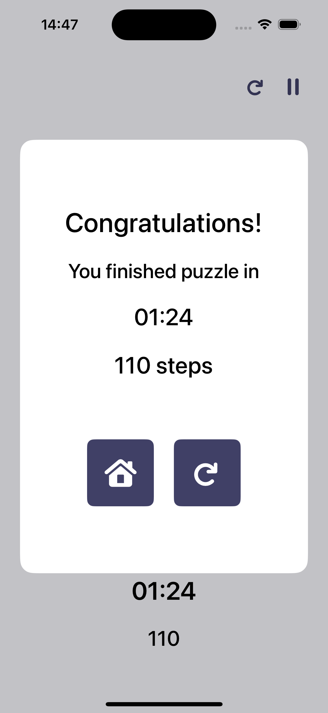

# Puzzle 15

A classic puzzle game of 15 written in pure SwiftUI.

## Features

- Customizable field size (from 3 to 10)
- Always solvable fields
- Changable color schemes

## Screenshots

## Requirements

- iOS 16+

## Tools

- Swift
- SwiftUI
- Custom DI
- MVVM + Coordinators
- UserDefaults